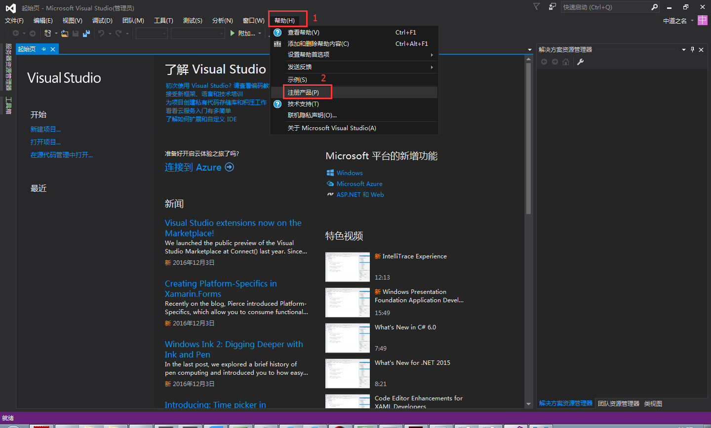
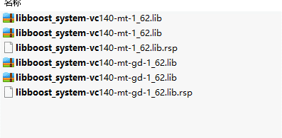
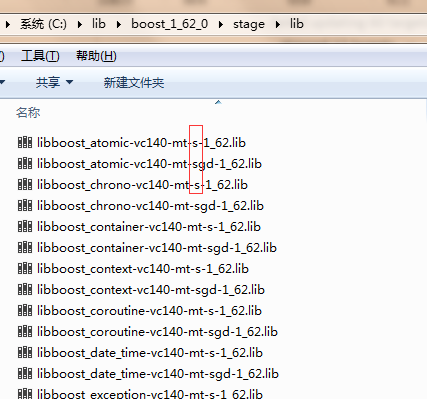

  
  
  

## VisualStudio2015

## 上编译安装SDChain-Core流程

目录

1 开发环境的安装        3

1.1 Microsoft Visual Studio Community 2015        3

1.2 git for windows        4

1.3 Google Protocol Buffers Compiler        4

1.4 python和scons        4

1.5 openssl-64bit        4

1.6 boost        5

2 平台配置        6

2.1 在vs2015中配置库路径        6

2.2设置环境变量        6

2.3更改 Visual Studio Projects调试属性        6

2.4告知sdchaind工程配置文件的路径        6

2.5设置\_NO\_DEBUG\_HEAP环境变量        7

2.6编译        7

## 1 开发环境

## 的安装

 本文档基于以下系统进行的环境部署：

  版本：Windows 7 旗舰版

  处理器：Intel Core i3

  内存（RAM）：8.00GB

  系统类型：64位操作系统

## 1.1 Microsoft Visual Studio Community 2015

版本14.0.25431.01 Update 3

（1）安装包：
   vs2015.zip

（2）解压安装包后，将iso文件解压，双击vs\_community.exe文件。默认安装即可。

（3）vs2015许可证问题

 进入注册产品窗口；

如果没有微软账户，可以立即注册，然后在登录使用；

如果有微软账号，可以直接登录，然后系统会自动为你配置并下载许可证。

成功后，会显示&quot;已成功更新你的许可证&quot;。

## 1.2 git for windows

版本 2.14.1

（1）安装包
    Git-2.14.1-64-bit.zip

（2）安装完成后，在命令行输入git –version。如果有版本号的信息，则表明安装完成。

## 1.3 Google Protocol Buffers Compiler

版本 2.5.1

（1）安装包
    protoc.exe

（2）下载protoc.exe文件

把其存放位置添加到环境变量PATH中。

建议将protoc.exe拷贝到C:\Program Files (x86)\Microsoft Visual Studio 14.0\VC\bin中，因为PATH环境变量中已经包含了这个路径。

## 1.4 python和scons

Python版本 2.7.13

Scons版本 3.0.0

（1）安装包
    Python-2.7.13.amd64.msi
    Scons-3.0.0.zip

（2）python直接运行即可；

scons的安装包解压后，通过命令# python setup.py install安装。

安装完成后，在命令行中输入python –v和scons –v能够查看到对应的版本号即可。

## 1.5 openssl-64bit

版本 1\_0\_2k

（1）安装包
    Win64OpenSSL-1_0_2k.exe

## 1.6 boost

版本 1\_62\_0

（1）安装包
    boost_1_62_0.tar.bz2

（2）下载解压，在&quot;开始&quot;菜单栏，选择&quot;visual studio 2015/visual studio tools/vs2015开发人员命令提示&quot;，右击选择&quot;以管理员身份运行&quot;。

进入命令行窗口，切换到boost\_1\_62\_0的安装目录下，执行下面三行命令。

cd C:\lib\boost\_1\_62\_0

bootstrap.bat

.\b2

执行结束后，提示&quot;The Boost C++ Libraries were successfully built!&quot;，表明已经安装成功。

（3）编译过程中可能出现的问题

① 编译boost库，&#39;cl&#39; 不是内部或外部命令，也不是可运行的程序。

原因：说明VS没有安装或者环境变量设置不正确，可以按照如下步骤设置：

1. 1)确保已经安装VS，并在控制台中键入set检查是否有类似如下格式的环境变量VSXXCOMNTOOLSVS90COMNTOOLS=D:Program FilesMicrosoft Visual Studio 9.0Common7Tools 其中XX与VS版本有关。如果没有，则进行第2)步。
2. 2)新建一个环静变量

变量名: VSXXCOMNTOOLS（这里装的是vs2015，对应的就是VS140COMNTOOLS ）

变量值: VS安装目录Common7Tools\（这里 C:\Program Files (x86)\Microsoft Visual Studio 14.0\Common7\Tools\）

1. 3)设置cl运行时的一些环境变量cl 确保没有提示出错。在控制台中键入call &quot;%VS140COMNTOOLS%&quot;vsvars32.bat；否则重复步骤1。

②提示

【/boost/python/detail/wrap_python.hpp:75:24: 致命错误：patchlevel.h：没有那个文件或目录

 编译中断。

...failed updating 60 targets...

 ...skipped 12 targets...

 ...updated 79 targets...

用boost编写的动态链接库不能用。】

 解决步骤：

1. 1)在命令行，输入命令.\b2 --without-python

提示&quot;the boost c++ libraries were successfully built!&quot;就说明成功了。

1. 2)如果没有成功，那么看一下是否安装了其他版本的visual studio，如果有，请卸载，保证电脑上只安装了visual stdio 2015。否则会影响boost的编译。
2. 3)试一下面两条命令

bjam --toolset=msvc-14.0 variant=debug,release link=static runtime-link=static address-model=64

bjam --toolset=msvc-14.0 address-model=64 architecture=x86 link=static threading=multi runtime-link=shared,static stage --stagedir=stage64

③编译出来的lib不是static，即lib文件名中不带有s。如下图：

  

正确的应该是下图：

  

那么请使用以下命令：

bjam --toolset=msvc-14.0 variant=debug,release link=static runtime-link=static address-model=64

#
## 2 平台配置

## 2.1 在vs2015中配置库路径

（1）打开在\*\*Builds/Visual Studio 2015/sdchain.sln\*\*路径下的sln文件，选择&quot;View-&gt;Property Manager&quot; ，

（2）展开 \*debug | x64\* 会话，双击\*Microsoft.Cpp.x64.user\* ，打开\*Property Pages\* 对话界面，

（3）选择 \*C/C++, General, Additional Include Directories\* ，添加boost安装路径。

（4）选择\*Linker, General, Additional Library Directories\* ，添加构建boost库的路径。就是提示&quot;the following directory should be added to linker library paths:&quot;后的路径。

这里是&quot;C:\lib\boost\_1\_62\_0\stage\lib&quot;

（5）在`Additional Include Directories`和`Additional Library Directories`下，同样的添加openssl对应的路径。

这里是 \*\*C:\lib\OpenSSL-Win64\include\*\*和\*\*C:\lib\OpenSSL-Win64\lib\*\*

## 2.2设置环境变量

（1）复制doc\sdchaind-example.cfg文件到`C:\Users\admin\sdchain\config`路径下，重命名为sdchaind.cfg。

sdchaind服务器使用sdchaind.cfg文件去读它的配置参数。请阅读sdchaind.cfg文件并合理编辑。

## 2.3更改 Visual Studio Projects调试属性

（1）打开\*\*Builds/Visual Studio 2015/Sdchain.sln\*\*，选择\*x64\*。

（2）选择 &quot;Project-&gt;Properties&quot;菜单，打开SdchainD属性页，在&quot;Configuration Properties&quot;中选择&quot;Debugging&quot;，在左侧配置栏选择 &quot;All Configurations&quot;，在 &quot;Debugger to Launch&quot;选择&quot;Local Windows Debugger&quot;。

## 2.4告知sdchaind工程配置文件的路径

在属性页对话框中，&quot;Command Arguments&quot; 一栏，添加

--conf=&quot;C:/Users/admin/sdchain/config/sdchaind.cfg&quot;

## 2.5设置_NO_DEBUG_HEAP环境变量

在&quot;Environment&quot; 一栏，填写\_NO\_DEBUG\_HEAP=1，禁用debug heap以加快sdchaind run的时间。

## 2.6编译

右击sdchaind工程，选择\*\*Set as Startup Project\*\*，再点击\*\*Build-&gt;Build Solution\*\*按钮。

编译过程可能出现的问题：

（1）Visual Studio: LINK : fatal error LNK1181: cannot open input file libeay32MTd.lib

     是boost 1.62 的问题，去到 Linker, General, Additional Library Directories and 加入如下 库路径，问题解决。

  C:\OpenSSL-Win64\lib
